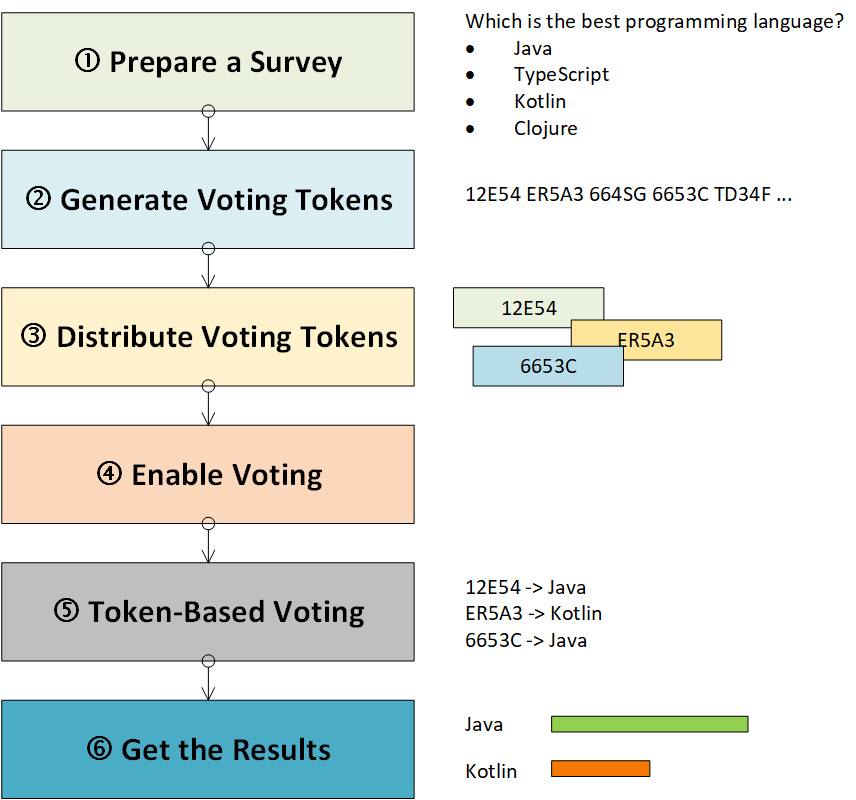
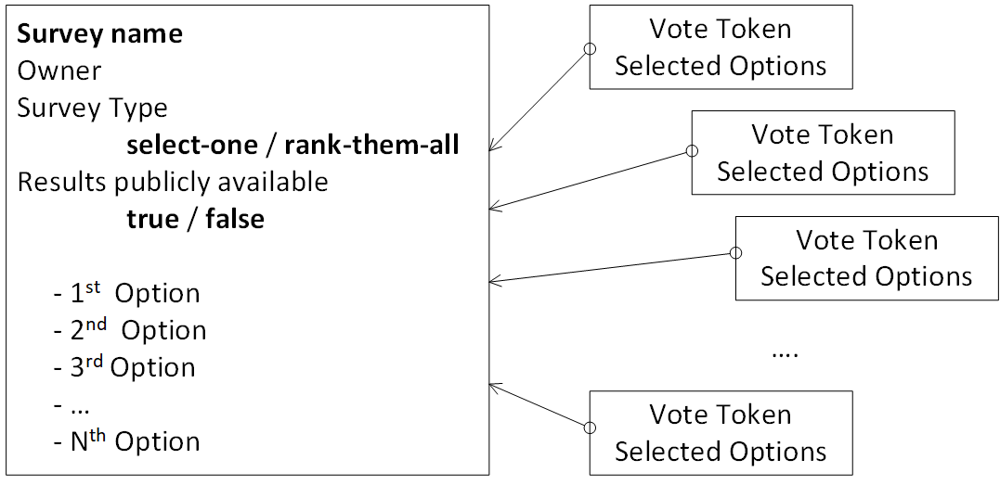

# VoteIT!

VoteIT SaaS for the simpliest possible online, anonymous, guaranteed one-participant-one-vote feedbacks.

Current development progress:
- 
- 
- 

## Scope
- Backend handles **Surveys** (title, owner, survey type, option to publicly expose results, several ordered options) and **Voting Tokens**
- For every survey, owner can generate as many tokens as needed - token distribution is not in the scope of the VoteIT! solution
- Tokens are translated into **Votes** - one token, one vote
- Security is managed outside (e.g. Firebase), user_id (unique string) is required
- Frontend is a simple one-stop-shop SPA web client

The usage process explained:

## Prerequisites
 - Environment, running Mysql or
 - Container host

## Tech stack
- Backend is a SpringBoot microservice, exposed via Rest interface
- Data is stored in MySql database
- Frontend is a React SPA

Conceptual DB overview:

## Running
 - build & run or
 - docker-compose build & docker-compose up

